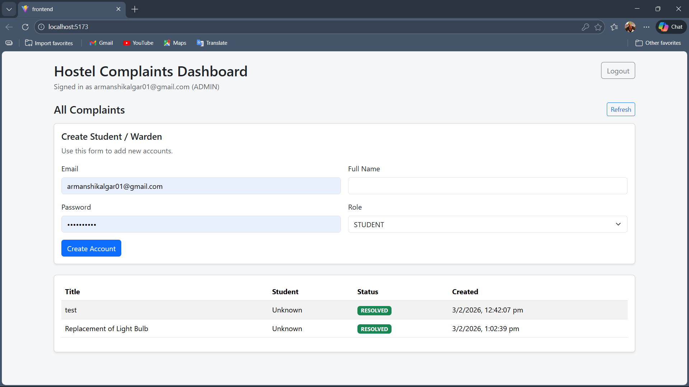
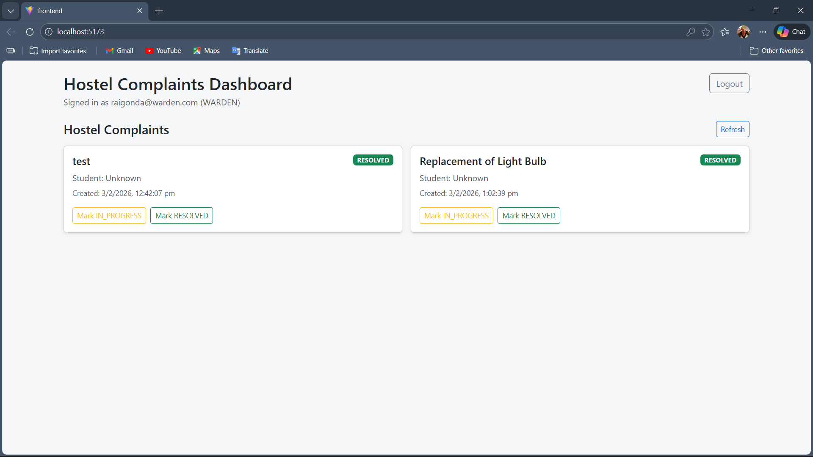

# 🏨 Hostel Management System

A scalable **Role-Based Hostel Management Backend** built using **Django REST Framework (DRF)** with **JWT Authentication** and a **React Bootstrap Dashboard**.

This project demonstrates real-world backend architecture, modular system design, and role-based workflow automation for hostel administration.

---

## 🚀 Project Overview

Traditional hostel management relies heavily on manual record keeping, which often leads to:

- Inefficient room allocation
- Poor complaint tracking
- Manual fee monitoring
- Lack of centralized role-based access

This system provides a secure and automated backend solution that manages hostel operations through REST APIs.

---

## ✨ Core Features

### 🔐 Authentication & Role Management
- JWT-based authentication
- Custom User Model
- Role-Based Access Control (RBAC)

Supported Roles:
- 👨‍💼 Admin
- 🧑‍✈️ Warden
- 🎓 Student

---

### 🏢 Hostel & Room Management
- Create and manage hostels
- Floor and room hierarchy
- Automated student room allocation
- Room availability tracking

---

### 🧾 Complaint Management
- Students can raise complaints
- Complaints automatically mapped to hostel
- Wardens resolve hostel-specific complaints
- Status workflow:
  - OPEN
  - IN_PROGRESS
  - RESOLVED

---

### 📱 API-First Architecture
Backend designed to support:
- Web dashboards
- Mobile applications
- Third-party integrations

---

## 💻 Frontend Dashboard

Built using **React + Bootstrap** to demonstrate backend workflows.

Includes:
- Authentication UI
- Admin Management Panel
- Student Complaint Dashboard
- Warden Complaint Resolution Panel
- Fee Tracking Interface

---

## 🧩 Tech Stack

### Backend
- Django
- Django REST Framework
- Simple JWT Authentication
- Custom Permission System

### Frontend
- React (Vite)
- Bootstrap 5
- Axios

### Database
- SQLite (Development)

### Deployment 
- Docker

---

## 📸 Screenshots

### 👨‍💼 Admin Panel
Admin manages hostels, users, rooms, and system-wide operations.



---

### 🧑‍✈️ Warden Panel
Wardens monitor hostel complaints and update resolution status.



---

### 🎓 Student Panel
Students can track room details, raise complaints, and monitor fee status.


---
## 📁 Project Structure
Hostel_Management_DRF/
│
├── accounts/ # User authentication & roles
├── hostels/ # Hostel and warden mapping
├── rooms/ # Room and allocation logic
├── complaints/ # Complaint workflow system
├── payments/ # Fee and payment tracking
├── common/ # Constants and permissions
├── config/ # Project settings
│
├── frontend/ # React dashboard
├── requirements.txt
└── manage.py

---

## 🔑 Key API Modules

### Authentication
POST /api/auth/login/
POST /api/auth/refresh/
GET /api/auth/me/


---

### Hostel & Room Management
POST /api/hostels/
POST /api/rooms/
POST /api/rooms/allocate/


---

### Complaint Management
POST /api/complaints/
GET /api/complaints/
PATCH /api/complaints/{id}/

## 📊 Role-Based Feature Access

| Feature | 👨‍💼 Admin | 🛡️ Warden | 🎓 Student |
|----------|------------|------------|------------|
| Manage Students | ✅ | ❌ | ❌ |
| Manage Hostels | ✅ | ❌ | ❌ |
| Room Allocation | ✅ | ✅ | ❌ |
| Raise Complaint | ❌ | ❌ | ✅ |
| Resolve Complaint | ❌ | ✅ | ❌ |

---


## ⚙️ Setup Instructions

```bash
1️⃣ Clone Repository
git clone https://github.com/Arman1263/Hostel-Management-DRF-Porject.git
cd Hostel-Management-DRF-Porject

2️⃣ Create Virtual Environment
python -m venv venv
Activate:
Windows:
venv\Scripts\activate
Linux / Mac:
source venv/bin/activate

3️⃣ Install Dependencies
pip install -r requirements.txt

4️⃣ Environment Variables
Create .env file:
SECRET_KEY=your-secret-key
DEBUG=True

5️⃣ Apply Migrations
python manage.py migrate

6️⃣ Create Admin User
python manage.py createsuperuser

7️⃣ Run Backend Server
python manage.py runserver

8️⃣ Run Frontend
cd frontend
npm install
npm run dev
```
## 🧪 Demo Workflow

1. Admin creates hostels and rooms  
2. Admin assigns students and wardens  
3. Student raises complaint or checks fee status  
4. Warden resolves complaints  
5. Admin monitors full hostel analytics  

---

## 🔮 Future Enhancements

1. Mobile App Integration  
2. Payment Gateway Integration (Razorpay / Stripe)  
3. Notification System (Email & SMS)  
4. Analytics Dashboard  
5. Multi-Hostel SaaS Version  

--- 

Here is **only the Docker section**, formatted properly and consistent with the rest of your README structure.
Replace your current raw Docker text with this:

---

## 🐳 Docker Deployment

### 🧰 Prerequisites

Install Docker Desktop:

[https://www.docker.com/products/docker-desktop/](https://www.docker.com/products/docker-desktop/)

That’s it. No need to install Python, Node.js, or manage dependencies manually.

---

### 🚀 Run Using Docker (Recommended)

#### 🔹 Option 1 — Quick Run (Without Cloning Repository)

Run backend:

```bash
docker run -d -p 8000:8000 --name backend armanshikalgar/hostel-backend:1.0
```

Run frontend:

```bash
docker run -d -p 3000:80 --name frontend armanshikalgar/hostel-frontend:1.0
```

Then open:

* **Backend →** [http://localhost:8000](http://localhost:8000)
* **Frontend →** [http://localhost:3000](http://localhost:3000)

---

#### 🔹 Option 2 — Using Docker Compose (Best Practice)

Create a file named `docker-compose.yml`:

```yaml
version: "3.9"

services:
  backend:
    image: armanshikalgar/hostel-backend:1.0
    ports:
      - "8000:8000"

  frontend:
    image: armanshikalgar/hostel-frontend:1.0
    ports:
      - "3000:80"
    depends_on:
      - backend
```

Run:

```bash
docker compose up -d
```

To stop:

```bash
docker compose down
```

---

### 🔄 Restart After Shutdown

If containers already exist:

```bash
docker start backend
docker start frontend
```

---

### 🗑️ Remove Containers

```bash
docker rm -f backend frontend
```
---

👨‍💻 Author
Arman Shikalgar
AI & Data Science Student
